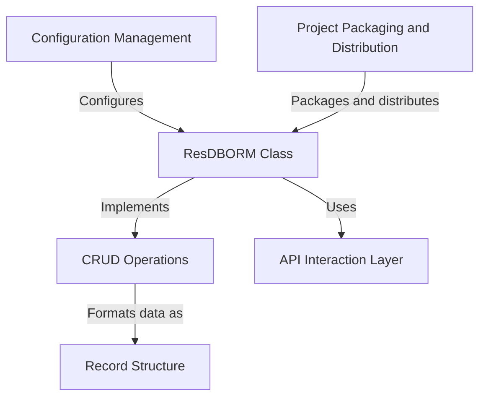

import { CommentSection } from '@/components/CommentSection'
import { Divider, Box, Space, Alert, Text, Code, Title } from '@mantine/core'
import { IconInfoCircle, IconCheck, IconAlertTriangle } from '@tabler/icons-react'

{/* BEGIN AUTO_DOC: resdb-orm */}

# resdb-orm

This project provides a simple Python tool that acts as a friendly translator for the *ResilientDB key-value store*.
Instead of writing complex network requests, you can use the **`ResDBORM` class** to easily *Create, Read, Update, and Delete* your data, just like managing files in a folder.
It handles all the technical communication with the database behind the scenes.




`resdb-orm` is a lightweight Object-Relational Mapper (ORM) designed to simplify interactions with a ResilientDB key-value store. It provides a clean, high-level interface that abstracts away the complexities of direct API communication, allowing you to manage your data with simple Python commands.

## Getting Started

Before using the library, you need to install it and configure the database connection.

### Installation

Install the library from PyPI using pip. The installation command automatically handles all necessary dependencies, such as `requests` and `PyYAML`.

```bash
pip install resdb-orm
```

### Configuration

`resdb-orm` reads the database endpoint from a `config.yaml` file in your project's root directory. This separates configuration from your application code, making it easy to switch between different database environments (e.g., development and production).

Create a `config.yaml` file with the following structure:

```yaml
# File: config.yaml
database:
  db_root_url: http://0.0.0.0:18000
```

Replace the `db_root_url` value with the endpoint address provided by your running ResilientDB-GraphQL service. The `ResDBORM` class reads this URL upon initialization to know where to send requests.

## Core Usage: The `ResDBORM` Class

The `ResDBORM` class is the central component of the library and serves as the primary interface to the database. All operations are performed through an instance of this class.

First, import and instantiate the class:

```python
from resdb_orm.orm import ResDBORM

# This object is now your gateway to the database
orm = ResDBORM()
```

When `ResDBORM()` is called, it automatically locates and parses `config.yaml` to prepare for communication.

### CRUD Operations

The library provides four fundamental methods for data management, corresponding to Create, Read, Update, and Delete operations.

All data is stored in a standardized record structure: a JSON object containing a unique, auto-generated `id` and a `data` field that holds the information you provide.

The following example demonstrates the complete lifecycle of a data record.

```python
from resdb_orm.orm import ResDBORM

# 1. Initialize the ORM
orm = ResDBORM()

# 2. Create a new record
# The `create` method accepts a dictionary and returns a unique ID.
user_data = {"name": "Alice", "city": "Wonderland"}
user_id = orm.create(user_data)
print(f"Created record with ID: {user_id}")

# 3. Read the record
# The `read` method fetches the full record using its ID.
retrieved_user = orm.read(user_id)
print("Retrieved record:", retrieved_user)
# Output will be: {'id': '...', 'data': {'name': 'Alice', 'city': 'Wonderland'}}

# 4. Update the record
# The `update` method takes the record ID and a dictionary with the new data.
updated_data = {"name": "Alice", "city": "Metropolis"}
orm.update(user_id, updated_data)
print("Record updated.")

# Verify the update
updated_user = orm.read(user_id)
print("Verified update:", updated_user['data']['city']) # Output: Metropolis

# 5. Delete the record
# The `delete` method removes the record permanently using its ID.
orm.delete(user_id)
print("Record deleted.")
```

## How It Works

`resdb-orm` provides a simple interface by handling the underlying mechanics of data formatting and API communication.

### Record Structure

Every piece of data is wrapped in a consistent "record" format before being sent to the database. This structure acts as a labeled container for your information.

*   `id`: A unique string identifier, automatically generated by the ORM during creation. It acts as the primary key.
*   `data`: The original Python dictionary you provided.

For example, `orm.create({"name": "Alice"})` sends the following JSON payload to the server:
```json
{
  "id": "a-unique-auto-generated-id",
  "data": {
    "name": "Alice"
  }
}
```

### API Interaction Layer

The library uses the popular `requests` library to handle all network communication with the ResilientDB API. The `ResDBORM` class constructs the appropriate HTTP requests and delegates the task of sending them.

-   **Create (`create`)**: Sends an HTTP `POST` request to the `/v1/transactions/commit` endpoint with the record as a JSON payload.
-   **Read (`read`)**: Sends an HTTP `GET` request to `/v1/transactions/{key}` where `{key}` is the record's ID.
-   **Update (`update`)**: Sends an HTTP `POST` request, similar to `create`.
-   **Delete (`delete`)**: Sends an HTTP `POST` request to remove the record.

This layer ensures that headers like `Content-Type: application/json` are correctly set and that data is properly serialized, abstracting these low-level details from the user.

---

Generated by [AI Codebase Knowledge Builder](https://github.com/The-Pocket/Tutorial-Codebase-Knowledge)

{/* END AUTO_DOC: resdb-orm */}

<Space h="xl" />
<Divider my="xl" label="Community Feedback" labelPosition="center" />

<Box mb="xl">
  <CommentSection
    pageTitle="ResDB-ORM Documentation"
    pageUrl={typeof window !== 'undefined' ? window.location.href : ''}
    repoOwner="apache"
    repoName="incubator-resilientdb-ResDB-ORM"
    labels={['user-feedback', 'documentation', 'resdb-orm']}
    title="Questions or Feedback about ResDB-ORM?"
  />
</Box> 