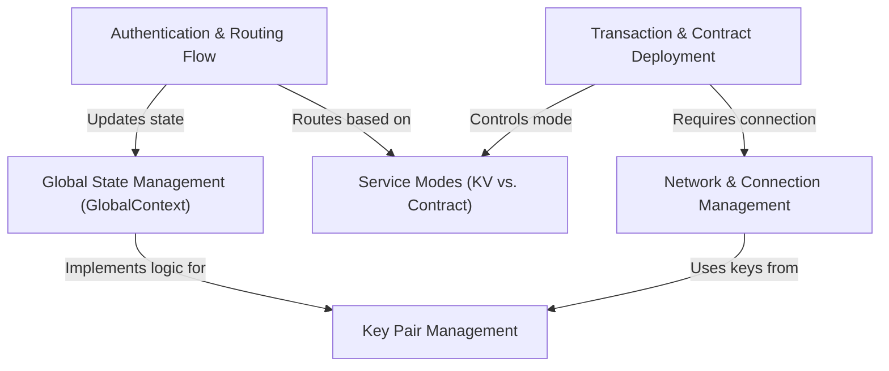

import { CommentSection } from '@/components/CommentSection'
import { Divider, Box, Space, Alert, Text, Code, Title } from '@mantine/core'

{/* BEGIN AUTO_DOC: resvault */}

# resvault

`resvault` is a browser extension wallet that manages user accounts using *cryptographic key pairs*. It operates in two distinct modes: a simple **Key-Value (KV) store** for basic transactions and a more advanced **Smart Contract** mode for deploying contracts to a blockchain network. The wallet allows users to securely create, import, and manage multiple accounts while connecting to different networks.




ResVault is a browser extension wallet designed for secure cryptographic key management and interaction with blockchain networks. It provides a robust framework for handling user authentication, managing multiple accounts, and submitting transactions, all while maintaining a strict security model. This guide outlines the core architecture and functionality of the ResVault application.

## Authentication and Routing

ResVault's navigation is governed by a user's authentication status. The main application router, located in `src/App.js`, acts as a traffic controller, directing users to different sets of pages based on whether they are logged in.

This logic hinges on a single state variable, `isAuthenticated`, managed by the `GlobalContext`.

```javascript
// src/App.js
function App() {
  const { isAuthenticated } = useContext(GlobalContext);

  return (
    <Routes>
      {!isAuthenticated ? (
        // Render public routes (Login, SignUp, Home)
      ) : (
        // Render secure, authenticated routes (Dashboard)
      )}
    </Routes>
  );
}
```

### Public Routes
When a user is not authenticated (`isAuthenticated` is `false`), they are restricted to a few public pages:
*   `/`: The main landing page.
*   `/signup`: The account creation page.
*   `/login`: The account login page.
*   Any other path (`*`) redirects the user to the home page.

### Authenticated Routes
Upon successful login, `isAuthenticated` becomes `true`, and the router switches to the secure routes.
*   `/dashboard` or `/contract`: The main functional dashboards.
*   Any other path (`*`) now redirects the user to their dashboard, preventing access to public pages like `/login` while authenticated.

The login process is the key transition point. On a successful password verification, the `loginAccount` function sets the global state and redirects the user.

```javascript
// src/pages/Login.jsx
const loginAccount = async (e) => {
  // ... password verification ...

  // 1. Update global state
  setIsAuthenticated(true);
  
  // 2. Redirect to the secure area
  navigate("/dashboard");
};
```

## Key Pair Management

Each account in ResVault is a cryptographic key pair, consisting of a shareable **public key** and a secret **private key** used for signing. The wallet's core function is to securely manage the entire lifecycle of these key pairs. All key management logic is centralized in `src/context/GlobalContext.js`.

The security of the wallet is based on a cycle of generation, encryption, storage, and decryption.

1.  **Generation**: New key pairs are created using the `tweetnacl` library.
2.  **Encryption**: The entire list of a user's key pairs is stringified into JSON and then encrypted using their password with `CryptoJS.AES`. ResVault **never** stores private keys or passwords in plain text.
3.  **Storage**: The resulting encrypted string is the only sensitive data saved to `chrome.storage.sync`.
4.  **Decryption**: When a user logs in, the stored data is fetched and decrypted using the password they provide. If successful, the decrypted keys are loaded into the application's memory for the session.

```javascript
// src/context/GlobalContext.js
const saveKeyPairsToStorage = (keyPairs, password) => {
  // Encrypt the JSON string of all key pairs
  const encryptedKeyPairs = CryptoJS.AES.encrypt(
    JSON.stringify(keyPairs),
    password
  ).toString();

  // Save only the encrypted text to Chrome's storage
  chrome.storage.sync.set({ encryptedKeyPairs });
};
```

## Service Modes: KV vs. Contract

ResVault operates in two distinct service modes to provide a focused user experience for different backends. This is controlled by the `serviceMode` state variable.

### Key-Value (KV) Mode
*   **Purpose**: Interacting with a simple key-value database.
*   **UI**: Renders the `Dashboard.jsx` component, which is optimized for submitting simple JSON transactions.
*   **Identity**: Uses the account's **Public Key** as the primary identifier.

### Smart Contract Mode
*   **Purpose**: Deploying and interacting with smart contracts (e.g., Solidity).
*   **UI**: Renders the `Contract.jsx` component, featuring tools to upload `.sol` and configuration files.
*   **Identity**: Uses the **Owner Address** (e.g., `0x...`) derived from the public key.

Users can toggle between modes via a badge in the UI. This action calls `toggleServiceMode`, which updates the `serviceMode` state in `GlobalContext`, triggering the `App.js` router to display the corresponding dashboard component.

## Network and Connection Management

The wallet provides granular control over network connections and site permissions, ensuring users control where their wallet operates and which applications can interact with it.

### Network Selection
A dropdown menu allows users to switch between different blockchain networks (e.g., Mainnet, Localnet, or custom networks). Selecting a network updates the target server URL in the global state and persists this choice in `chrome.storage.local` for future sessions. For security, switching networks automatically disconnects the wallet from any connected site.

### Site Connection Permissions
ResVault does not expose a user's wallet to websites by default. A user must explicitly grant permission by clicking a "connect" icon for each specific website. This action triggers a secure handshake:

1.  The UI sends a `storeKeys` message to the extension's isolated background script.
2.  The message securely passes the active keys, network URL, and the website's domain.
3.  The background script stores this information in its memory, associating the keys only with that specific domain and network.

When disconnecting, a `disconnectKeys` message is sent, and the background script erases the keys associated with that site, revoking its permissions. This ensures private keys never leave the secure context of the wallet extension.

## Submitting Transactions and Deploying Contracts

The wallet's primary function is to sign and submit data to the blockchain. This process follows a secure hand-off pattern where the UI prepares the data, but all cryptographic operations happen in the secure background script.

### Submitting a KV Transaction
In KV Mode, the user uploads a JSON file containing transaction details to `Dashboard.jsx`. Clicking "Submit" initiates the following flow:
1.  **Hand-off**: The UI sends a `submitTransactionFromDashboard` message to the background script with the transaction data.
2.  **Signing**: The background script retrieves the stored private key for the session and signs the transaction.
3.  **Dispatch**: The signed transaction is sent to the selected network's server.
4.  **Confirmation**: The background script awaits a success or error response and forwards it back to the UI, which then notifies the user.

### Deploying a Smart Contract
The process is similar in Contract Mode. The user uploads a Solidity (`.sol`) file and a configuration (`.json`) file. Clicking "Deploy" sends a `deployContractChain` message to the background script, which then handles the compilation, signing, and deployment of the contract.

```javascript
// src/pages/Dashboard.jsx - The UI hand-off
const handleSubmit = () => {
  chrome.runtime.sendMessage({
    action: 'submitTransactionFromDashboard',
    transactionData: transactionData,
    domain: domain,
    net: selectedNet,
  }, (response) => {
    // Handle the success or error response from the background script
  });
};
```

## Global State Management with GlobalContext

ResVault relies on a centralized state management system, `GlobalContext`, to ensure data consistency across all components. This context acts as a "single source of truth" for the application's most critical state, including:
*   `isAuthenticated`: The user's login status.
*   `serviceMode`: The active service mode (`'KV'` or `'Contract'`).
*   `keyPairs`: The list of the user's decrypted accounts.
*   `selectedNet`: The currently active network.

The entire application is wrapped in a `<GlobalProvider>` component, which makes this state available to all child components.

### Reading and Writing to State
Components can read from and write to this global state using React's `useContext` hook.

*   **Reading State**: To access a value, a component destructures it from `useContext`.
    ```javascript
    const { isAuthenticated, serviceMode } = useContext(GlobalContext);
    ```
*   **Updating State**: To change a value, a component calls one of the update functions provided by the context.
    ```javascript
    const { setIsAuthenticated } = useContext(GlobalContext);
    setIsAuthenticated(true);
    ```

When an update function is called, the state in `GlobalContext` changes, and React automatically re-renders any component that depends on that piece of state, ensuring the UI is always synchronized.

This architecture provides a secure and maintainable foundation for managing digital assets and interacting with decentralized applications.

---

Generated by [AI Codebase Knowledge Builder](https://github.com/The-Pocket/Tutorial-Codebase-Knowledge)

{/* END AUTO_DOC: resvault */}

<Space h="xl" />
<Divider my="xl" label="Community Feedback" labelPosition="center" />

<Box mb="xl">
  <CommentSection
    pageTitle="ResVault Documentation"
    pageUrl={typeof window !== 'undefined' ? window.location.href : ''}
    repoOwner="apache"
    repoName="incubator-resilientdb-resvault"
    labels={['user-feedback', 'documentation', 'resvault']}
    title="Questions or Feedback about ResVault?"
  />
</Box> 